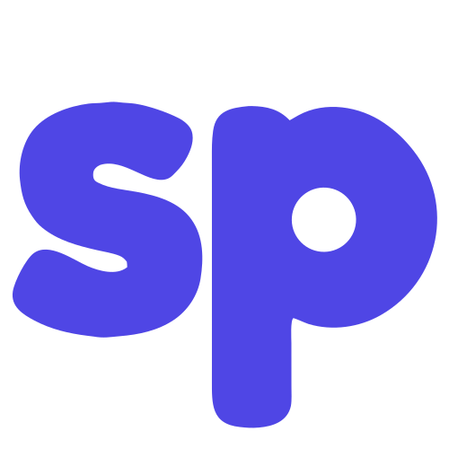

<div align="center">

  

  # Small Projects ✦ Portfolio 🎨

  **A vibrant, interactive, and tactile showcase of web experiments, tools, games, and mini-apps built with a strict Neumorphism (Soft UI) design system.**

  [](https://metanef.github.io/small-projects/)
  [](#)

  <br />

  [](#)
  [](#)
  [](#)
  [](#)
  [](#)
  [](#)

</div>

---

## 🌐 Live Demo & Overview

Try the application live: **[Small Projects Portfolio](https://metanef.github.io/small-projects/)**

### 🎨 Neumorphic (Soft UI) Web Showcase
- **Zero Heavy Frameworks**: Built strictly with Vanilla HTML5, CSS3, and JavaScript for lightning-fast page loading and maximum performance.
- **Strict Neumorphism Design System**: Tactile dual-shadow extrusion physics (`8px 8px 16px`), inset sunken art viewports, smooth 20px–28px rounded corners, and zero hard outline borders.
- **Custom Engraved SP Logo & Favicon**: Custom vector monogram (`src/logo.svg`) with carved bevel inset highlights, integrated as high-DPI SVG favicon and footer back-to-top button.
- **Composite Background Lighting**: Combined micro-grid dot matrix stacked over an enhanced 135° directional light source gradient for high-end visual depth.
- **Responsive 3×3 Grid**: Clean 3-column fixed layout (`max-width: 1320px`) displaying 9 handcrafted mini-projects.
- **Ultra-Smooth Scrolling**: Integrated Lenis.js (`duration: 0.8s`) for fluid wheel interaction and smooth anchor scrolling.
- **External JSON Dataset**: Asynchronous fetching of `src/projects.json` for decoupled data management.

---

## 📦 Featured Projects (3×3 Showcase)

| # | Project Name | Category | Live Demo URL | Description |
| :-: | :--- | :-: | :--- | :--- |
| ⌚ | **WristCam — Casio WQV-1** | `app` | [Demo](https://metanef.github.io/casio-wqv-1/) | Retro web emulator reproducing the iconic 2000s Casio WQV-1 Wrist Camera smartwatch. |
| 🐧 | **How I Met A Pingu** | `game` | [Demo](https://metanef.github.io/pingu/) | Whimsical story game following an icy romance on the floe. |
| 🕹️ | **W4SD — Local Coop Hub** | `app` | [Demo](https://metanef.github.io/coop-game/) | Shared-keyboard local multiplayer hub for quick couch games with friends. |
| 🎴 | **Sparks & Sync** | `game` | [Demo](https://metanef.github.io/mismatched-libido/) | Playful conversation & decision card game for couples to bridge desires. |
| 🇰🇷 | **Annyeong — 15MinToLearnKorean** | `app` | [Demo](https://metanef.github.io/annyeong-15mintolearnkorean/) | Clean, bite-sized web app to master Hangul and Korean vocabulary in 15 mins a day. |
| 🖼️ | **Frame — Habit Tracker** | `app` | [Demo](https://metanef.github.io/frame/) | Offline-first personal journaling and daily habit tracking dashboard. |
| 🔒 | **VaultGuard** | `tool` | [Demo](https://metanef.github.io/bitwarden-vault-audit/) | Analyze password strength, reuse, and security metrics for Bitwarden vaults locally. |
| ♠️ | **Poker Party** | `game` | [Demo](https://metanef.github.io/poker-party/) | Fast-paced, browser-based poker room for casual games with friends. |
| 🚀 | **FreeL1fe** | `tool` | [Demo](https://metanef.github.io/freel1fe/) | Interactive financial independence calculator to project your path to early retirement. |

---

## ✨ Features

- **🧩 Balanced 3×3 Project Grid**: Displays 9 distinct project cards with custom emojis in the bottom-right corner, category tags, and dual-shadow relief.
- **🏷️ Standardized Categories**: Filter projects seamlessly between `all`, `game`, `tool`, and `app` with tactile inset/raised category pills.
- **🔍 Spring-Pop Modal Dialog**: Click any project tile to launch a raised neumorphic modal card featuring smooth cubic-bezier scaling (`transform: scale(0.92)` ➔ `scale(1)`), backdrop blur (`blur(12px)`), and a circular close button.
- **📜 Lenis Smooth Scroll**: Silky-smooth scrolling experience across desktop and mobile devices.
- **🎨 Neumorphic Design Tokens**: Custom CSS variables for surface tones (`#e8ecf2`), raised shadows, inset shadows, and high-contrast WCAG typography (`#1e293b`).
- **📱 Fully Responsive**: Fluid grid adaptation across desktop, tablet, and mobile screens.

---

## 🛠️ Tech Stack

| Technology | Usage |
| :--- | :--- |
| **HTML5** | Semantic structure, accessibility markup (WCAG), SVG favicon, and clean layout |
| **CSS3 (Vanilla)** | Neumorphism dual-shadow tokens (`box-shadow`), CSS Grid, Flexbox, custom background gradients, cubic-bezier modal transitions |
| **JavaScript (ES6+)** | Asynchronous JSON fetching (`fetch`), dynamic project dataset rendering, category filtering, modal state management |
| **JSON** | Decoupled project dataset (`src/projects.json`) |
| **Lenis.js** | Modern smooth scroll engine |
| **Google Fonts** | *Fredoka* (friendly headings), *Space Grotesk* (tech UI tags), *Inter* (body text) |

---

## 📂 Project Structure

```
├── .github/
│   └── workflows/
│       └── static.yml  # GitHub Pages deployment workflow
├── index.html           # Main HTML structure, Lenis initialization & SVG favicon
├── list.txt             # Reference list of the 9 featured projects & live links
└── src/
    ├── logo.svg         # Carved Neumorphic SP Monogram SVG logo & favicon
    ├── projects.json    # Project dataset (names, URLs, categories, descriptions, emojis)
    ├── style.css        # Complete Neumorphic design system, animations & responsive grid
    └── script.js        # Dynamic dataset fetching, filtering logic & modal handlers
```

---

## 🚀 Running Locally

No build tools or node modules required!

```bash
# 1. Clone the repository
git clone https://github.com/metanef/small-projects.git

# 2. Open index.html directly in your browser or serve locally
npx serve .
```

---

## 🗺️ Roadmap & Progress

### ✅ Completed (v2.1 STABLE)
- [x] **Externalized JSON Dataset**: Extracted project entries into `src/projects.json` for asynchronous `fetch()` loading.
- [x] **Smooth Elastic Modal Pop**: Implemented cubic-bezier spring scaling and 12px backdrop blur transition for modal opening & closing.
- [x] **Bottom-Right Tile Emojis**: Positioned tile emojis to the bottom-right corner of global cards to accommodate future screenshot placeholders.
- [x] **Synchronized Hover Physics**: Fixed tile hover transforms so card elements elevate in total visual sync with the card.
- [x] **Codebase Polish & Refactoring**: Cleaned and formatted `index.html` (SEO, WCAG accessibility), `style.css` (organized design tokens), and `script.js` (ES6 guards).
- [x] **Live Project Link Mapping**: Integrated active GitHub Pages demo URLs for all 9 projects.
- [x] **Custom Engraved Neumorphic Logo & Favicon**: Sculpted SP monogram (`src/logo.svg`) with carved bevel inset depth, configured as favicon and footer back-to-top button.
- [x] **Neumorphism (Soft UI) Overhaul**: Full UI refactor with dual-shadow tokens (`--shadow-raised` & `--shadow-inset`) and soft surface `#e8ecf2`.
- [x] **Composite Background System**: Micro-grid dot matrix stacked over an enhanced 135° directional light source gradient.
- [x] **Lenis Smooth Scroll**: Integrated `Lenis` (`duration: 0.8s`) for enhanced wheel and anchor navigation.
- [x] **GitHub Pages CI/CD**: Workflow configured in `.github/workflows/static.yml`.

### 🔄 Future Ideas (v2.2+)
- [ ] **Project Screenshots**: Add optional high-resolution previews for modal cards and card headers.
- [ ] **Dark Neumorphism Toggle**: Optional dark mode color palette.
